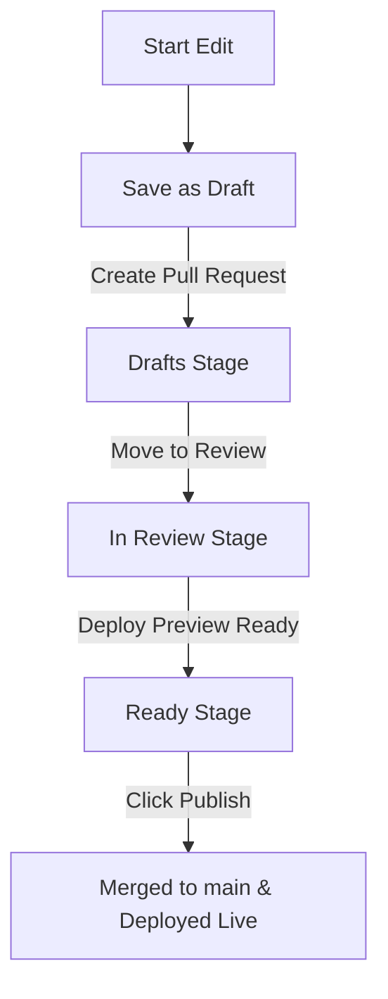

# Editorial Workflow & Concurrent Editing Guidelines

This document provides a guide for content editors, managers, and administrators working concurrently on the Kenya National Library Service (KNLS) Hugo project. Enabling the **Decap CMS Editorial Workflow** ensures that multiple writers can draft, review, and preview changes simultaneously without risk of overwriting each other's work or breaking the production site.

---

## 🔄 1. The Multi-Stage Approval Pipeline

Decap CMS uses a Git-based workflow that manages pages through three distinct stages before they go live on the official website:

1.  **Drafts**: The initial writing stage. Saving a page here automatically creates a separate Git branch (e.g., `cms/core-pages-who-we-are`) and opens a draft Pull Request on GitHub. No changes are live.
2.  **In Review**: The content is ready for proofreading. At this stage, Netlify automatically builds a isolated **Deploy Preview** URL.
3.  **Ready**: Approved content waiting to be scheduled or published by an administrator.
4.  **Published**: Merged into the `main` branch and deployed live to production.

---

## 🤝 2. Rules for Concurrent Editors

To ensure a smooth concurrent writing environment and avoid merge conflicts, all editors must follow these five rules:

### Rule 1: One Editor Per Page at a Time
*   **The Issue**: If Editor A and Editor B edit the *same* page (e.g., *Who We Are*) at the same time, the second person to save will encounter a conflict warning, potentially overwriting text.
*   **Action**: Coordinate assignments. If you see a card in the **Workflow** tab for a page you want to edit, check who is working on it first. Wait until their draft is published before starting your edits.

### Rule 2: Review Live Deploy Previews
*   **Action**: Before moving a card from **In Review** to **Ready**, click the **"View Preview"** button inside the Decap CMS editor. 
*   **Purpose**: This lets you audit the layout, check image dimensions, and test link routing on Netlify staging servers before public visitors see the page.

### Rule 3: Do Not Manually Edit `cms/` Branches on GitHub
*   **The Issue**: Decap CMS manages branches and pull requests automatically using Git metadata. Making manual git commits or merges on GitHub to branches starting with `cms/` can break the CMS interface connection.
*   **Action**: Perform all editing, reviewing, and publishing actions within the Decap CMS admin portal dashboard.

### Rule 4: Limit Media File Sizes
*   **Action**: Compress all photographs and graphics before uploading (aim for under **300 KB** per image). Uploading 5MB+ images will clog the repository, slow down other editors' local dev compiles, and waste citizen bandwidth.
*   **Tool**: If uploading PDFs, remember that the automated GitHub Action will compress them to web-optimized sizes in the background.

---

## 🛠️ 3. Resolving Merge Conflicts (For Admins)

If two editors make overlapping changes that Git cannot resolve automatically, a **Merge Conflict** is declared on GitHub, and the CMS will show a warning: *"This entry has conflicts that must be resolved manually."*

### Resolution Steps
1.  **Locate the PR**: Go to the GitHub repository and open the Pull Requests tab. Find the PR matching the CMS branch name (e.g. `cms/core-pages-who-we-are`).
2.  **Resolve on GitHub**:
    *   Click **Resolve conflicts** on the GitHub PR page.
    *   Compare the conflicting text blocks (delimited by `<<<<<<<` and `>>>>>>>`).
    *   Delete the conflict markers and keep the correct content structure.
    *   Mark as resolved and commit the merge.
3.  **Deploy**: Once resolved on GitHub, the CMS status will clear, and the page can be safely moved to **Ready** and published.
